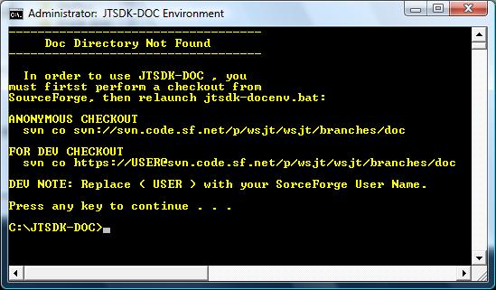

:prog: The WSJT Developers Guide

=== Windows Builds

The preferred method of building _WSJT Documentation_ on Windows is
using *JTSDK-DOC*. To install *JTSDK-DOC*, see <<WININSTALL,Windows Install>>
then perform the <<WINUPDATE,Update>>. This is all that is required.

[[WSJTCOMPILEOPTIONS]]
.BUILDING DOCUMENTATION

* Open Windows CMD terminal, at the prompt, type,:
----
C:\JTSDK-DOC\jtsdk-docenv.bat
----
* You should be presented with <<DOCMENU,Figure-1>>
* If you have not checked out Docs previously, you will be prompted
to do so:

.Doc Directory Not Found

TIP: If you intend to work on *( check-in )* documentation edits, you
should use the Developer check-out. If you do not have Developer access and
would like to work on documentation, see the <<DEVCO,Developer Section>>.

* Follow the prompts, Anonymous or Developer, type,:
-----
*For Anonymous Checkout*

svn co svn://svn.code.sf.net/p/wsjt/wsjt/branches/doc

*For Developers*

svn co https://USER%@svn.code.sf.net/p/wsjt/wsjt/branches/doc

DEV NOTE, Change ( USER ) to your SourceForge User Name

-----

TIP: Be sure to update JTSDK-DOC after checkout. Simply browse to and run:
*c:\JTSDK-DOC\doc\dev-guide\scripts\install-scripts.bat*. Running the
script will update all the SDKs you have installed.

* Once you have checked-out / updated the documentation branch, you can
build any of the documents with one command ( example uses wsjt ) type,:
-----
build wsjt

*Document Location, per example*
C:\JTSDK-DOC\doc\wsjt\wsjt-main.html

-----
* Then view the document, type,:
-----
wsjt
-----

.DOCUMENT HELP
* The main screen is the help screen, if you need to re-list it type,:
-----
doc-help
-----

=== Linux Builds

Under Construction
