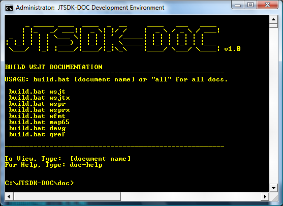
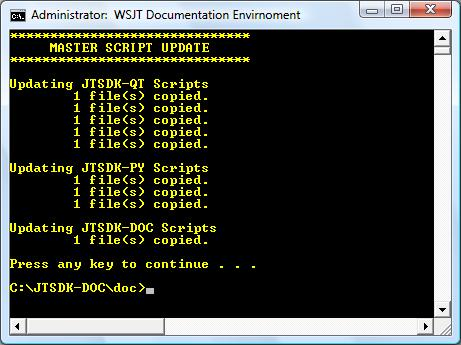

:page: The WSJT Developers Guide

[[BASE_ENV]]
Before you can start developing _WSJT_ applications, you must first 
set up your environment. _{page}_ will use the respective *JTSDK*
on Windows and */home/$USER/wsjt-env* on Linux as the containment area.

.The containment provides:
* A fixed structure to work from
* Provides system independent build tools (Windows Only)
* Produce repeatable results
* Create an experimental area to test builds
* Allows full testing without system installation (Windows Only)
* Provide build methods for non-developer testing

For *Windows*, software development kits provide the containment. Each
SDK provides the environment, plus all required tools to build a 
particular application. Details of each kit can be found at the end of
the Dev-Guide.

For *Linux*, the containment area uses /home/$USER/wsjt-env to house
the build scripts, any special libraries not provided by the
distribution and the final application builds.

.JTSDK Notes
* Each kit is self contained, you should not have to install any system
level software.
* All 5 main stream applications +*( WSJT, WSJT-X, WSPR, WSPR-X and MAP65 )+*
can be built using the appropriate SDK.
* If you have one or more required packages already installed on the
host system, the SDK will not interfere with your System Paths or use
System Applications to perform builds.

.JTSDK-DOC
* +*JTSDK-DOC*+ contains: Subversion, GNU Tools and scripts to build
all +*WSJT Documentation*+.
* For details, see <<JTSDKDOC,JTSDK-DOC>>.

[[DOCMENU]]
.JTSDK-DOC Main Menu

[[PYMENU]]
.JTSDK-PY
* +*JTSDK-PY*+ contains Python3 ({plus} modules}, Subversion, Mingw32, GNU Tools
and scripts required to build +*WSJT*+ and +*WSPR*+.
* For details, see <<JTSDKDOC,JTSDK-PY>>.

.JTSDK-PY Main Menu
image::images/jtsdk-py-main.png[]

.JTSDK-QT
* +*JTSDK-QT*+ contains QT5, CMake, Subversion, FFTW3, Mingw48_32, GNU Tools, 
hamlib-1.2, Hamlib-3 and scripts to build +*WSJT-X*+, +*WSPR-X*+ and
+*MAP65*+.
* For details, see <<JTSDKDOC,JTSDK-QT>>.

[[QTMENU]]
.JTSDK-QT Main Menu
image::images/jtsdk-qt-main.png[]

[[PATHCFG]]
=== Path Configuration 

The following paths are used throughout {page}. 

.WINDOWS
* Scripts and final builds will under:
** C:\JTSDK-DOC
** C:\JTSDK-PY
** C:\JTSDK-QT

.LINUX
* SRC, Builds, Support Libs and final binaries are in:
** /home/$USER/wsjt-env
* App location:
** /home/$USER/wsjt-env/$APP_NAME

TIP: /home$USER/wsjt-env is recommended, and used in this guide. This
keeps all _WSJT_ related activity together. The guide will also download
the build scripts to this location.

[[WININSTALL]]
== Windows SDK

Setup and installation is straight forward. Each SDK is a self
extracting 7z compressed file.

WARNING: The current update method for +*SDKs*+ is through +*JTSDK-DOC*+,
as such, is a mandatory install.

=== Download

[horizontal]
+*JTSDK-DOC*+:: {jtsdk_doc}
+*JTSDK-PY*+:: {jtsdk_py}
+*JTSDK-QT*+:: {jtsdk_qt}
+*Omni-Rig*+:: {omnirig} ( For WSJT-X CMake Builds Only )
* <<OMNIRIG,See Omni-Rig Special Instructions>>
+*Hamlib3*+:: {hamlib3} ( For WSJT-X CMake Builds Only )
* <<WSJTXCOMPILE, See Hamlib3 Special Instructions>>

=== Install

WARNING: If you choose to install an SDK in a different location
from the recommendation, you will need to reconfigure it, basically,
rebuild the SDK from scratch.

* Double Click or Right Click and Open the download
* Change path to: C:\
* Click the Extract Button

.Self Extracting 7z File
image::images/7z-extract.png[]

* Open a Windows CMD Terminal, then type,:
* You can also browse to the env file, and double click
----

*For JTSDK-DOC*
C:\JTSDK-DOC\jtsdk-docenv.bat

*For JTSDK-PY*
C:\JTSDK-PY\jtsdk-pyenv.bat

*For JTSDK-QT*
C:\JTSDK\jtsdk-qtenv.bat

----

[[WINUPDATE]]
=== Update

To update +*JTSDK-PY, JTSDK-QT*+, or +*JTSDK-DOC*+ you must install
+*JTSDK-DOC*+ and perform a check-out. Developer check-out is *not*
required, however, if you intend to work on Documentation, use your
Developer account v.s. Anonymous so you can *( check-in )* any edits
you have made.

.Update or Check-out then Update
* Open Windows CMD Terminal, and Type:
-----
C:\JTSDK-DOC\jtsdk-docenv.bat
-----
* If you need to check-out first:
-----
svn co svn://svn.code.sf.net/p/wsjt/wsjt/branches/doc

then type,:

update
-----
* To Update, just type:
-----
svn update

then type,:

update
-----
* You can also browse too, and run +*install-scripts.bat*+ manually
once you have performed an initial check-out.
* To ensure you always have the latest scripts, always perform an 
svn update  first;
-----
C:\JTSDK-DOC\jtsdk-docenv.bat

at the prompt type,:

svn update

then type,:

update
-----
* At this point, all three JTSDKs should be up to date, if installed.
* A successful update should look similar to:

.Master Script Update

=== Uninstall
* Delete (C:\JTSDK-DOC) , (C:\JTSDK-PY) or (C:\JTSDK-QT)
* Nothing is installed to the system or registry

**********************************************************************

.[red]#Omni-Rig Uninstall#

Due to recent changes in build requirements for _WSJT-X_, OmniRig
must be installed to build Debug or Release versions. OmniRig
comes with an uninstall program located under:

*Start >> Programs >> Omni-Rig >> Uninstall Omni-Rig*

**********************************************************************
