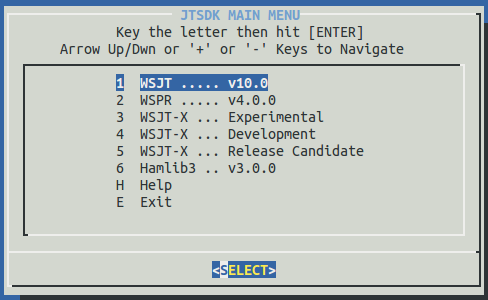
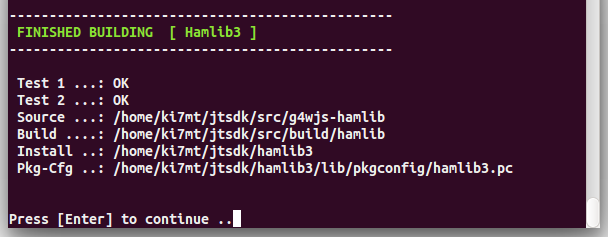
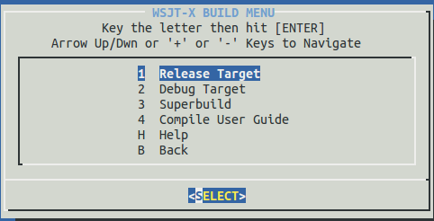
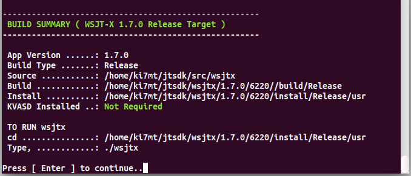

**_WSJT-X_** can be built on Windows, Linux and OS X. **_WSJT-X_** employs CMake
to manage the build process. There are many ways to build **_WSJT-X_**. This
guide will cover two primary methods:

. Build scripts for Windows, Dialog menu for Linux
. Manual entry from the command line

=== Windows
The standard method of compiling **_WSJT-X_** on Windows when using *JTSDK-QT*
is through the provided build scripts and shortcut commands.

The shell scripts provide a consistant method of build which use defaults
set in from the CMakeLists.txt file. With the exception of the Install Location,
the build script *do not* change any of the pre-set options.

If you want to customize a particular build, install location or option, you
must use the manual method described below, either with or without the aid of
CMake-GUI.

The shortcut commands provide a quick method of executing build commands without
having to type out long strings. These are similar in function to Linux Alias
Commands.

==== Compile With Scripts
Serveral targets exist for **_WSJT-X_**, both in Debug and Release. The commands
outlind below are used to checkout and build the Development Branch for types.

[[WIN32BUILDCOMMADS]]
.WSJT-X Development Branch Build Steps
[options="header,autowidth"]
|===
|Environment|Type|Command|Description

|JTSDK-QT
|Release
|
checkout-wsjtx +
build-wsjtx rconfig +
build-wsjtx rinstall +
build-wsjtx package +
build-wsjtx doc +

|
Checkout WSJT-X Development Branch from SVN +
Configure the *Release* Build Tree +
Build the *Release* Install Target +
Build the NSIS Win32 Installer +
Build the User Guide

|
|Debug
|
checkout-wsjtx +
build-wsjtx dconfig +
build-wsjtx dinstall +
build-wsjtx doc +

|
Checkout WSJT-X Development Branch from SVN +
Configure the *Debug* Build Tree +
Build the *Debug* Install Target +
Build the User Guide +

|===

.WSJT-X Special Notes
. *rconfig* and *dconfig* are used to configure the build tree, either
*Release* or *Debug*, but *do not* run the compiler. This function
can be used in conjuction with *Cmake-GUI* to enable or disable various elements
of the build.
. The *package* target exits only for the *Release* type
. The *User Guide* build has it's own Build and Install location. This is to
facilitated  working on documents without having to build the entire package.

.Commands for ( _Release and Debug_ )
=====
* Open *JTSDK-QT*, then type:
* Checkout and Configure Release Only ( no build )
-----
checkout-wsjtx
build-wsjtx rconfig
-----

* Checkout and Build Install Release Type
-----
checkout-wsjtx
build-wsjtx rinstall
-----

* Checkout and Configure Debug Only ( no build )
-----
checkout-wsjtx
build-wsjtx dconfig
-----

* Checkout and Build Install Debug Type
-----
checkout-wsjtx
build-wsjtx dinstall
-----

* Checkout and Build the User Guide
-----
checkout-wsjtx
build-wsjtx doc
-----
=====

=== Linux
Building **_WSJT-X_** on Linux differes slightly from Windows, in that, 
*JTSDK-Nix* provides a simple Ncurses Dialog menu for selecting package options
rather than being strictly command line entry.

At the time of this writing, *JTSDK-Nix* can build both the the Release
Candidate Branch ( _v1.6.0-RCx_ ) as well as the main Development Branch
( _v1.7.0_ ).

==== Comile Using Menu System
To build **_WSJT-X_** using the *JTSDK-Nix* Main Build Menu, launch *JTSDK*
from either your applications menu system, or open a terminal,
kbd:[Ctrl + Alt + t], then type:
-----
jtsdk
-----

The following screen should appear in your terminal:

.JTSDK-Nix Main Menu

.Build Hamlib3 before Building WSJT-X
****
Before building **_WSJT-X_**, select *Hamlib3* from the Main Build menu.
Only after sucessfully building *Hamlib3* should you proceed to the 
**_WSJT-X_** builds menus.
****

To build **Hamlib3**, simply select it form the Main Menu. If the build was
sucessful, you will be presented with the <<HAMLIB3SUCESS,image>> below. You 
should build Hamlib3 often as updates are frequently posted the integration
repository. Whenever you build *Hamlib3*, you must also build or rebuild
**_WSJT-X_** to integrate any changes that were made.

[[HAMLIB3SUCESS]]
.Sucessful Hamlib3 Build Summary

From this point, you can select to either build the Development Branch ( _v1.7.0_ )
or the current Release Candidate Branch ( _v1.6.0-RCx_ ). Build options
for both are identical, the difference being the repository source location.

.WSJT-X Build Menu

Serveral targets exist for **_WSJT-X_**, both in Debug and Release. The selections
outlined below is a brief description of what each perform.

[[WIN32BUILDCOMMADS]]
.Selection Descriptions
[options="header,autowidth"]
|===
|Selection|Description

|Release Target
|Default install target build

|Debug Target
|Default install target build with Debigging enabled

|Superbuild
|Builds Hamlib3 and WSJT-X using the Superbuild Script

|Compile User Guide
|Builds just the user guide

|Help
|Explination for each build option

|Back
|Returns to the Main Menu

|===

After the build finishes, you will be provided with a build summary detailing
various elements relevant to that particual build. A similar summary will be 
presented for all *JTSDK-Nix* builds that use the menu system.

.Sucessful WSJT-X Build Summary

