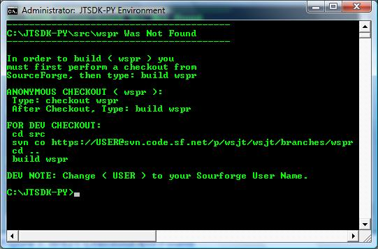

=== Windows

The preferred method of compiling _WSPR_ on Windows is using JTSDK-PY.
If you have not *Installed and Updated* JTSDK-PY, you should do so before
continuing, see <<WININSTALL,Windows Install>> and <<WINUPDATE,Update>>

TIP: You can create a desktop shortcut to +*jtsdk-pyenv.bat*+ if
desired. This can also be done for the final +*wspr.exe*+.

.Compiling WSPR

* Open Windows CMD terminal, at the prompt, type,:
----
C:\JTSDK-PY\jtsdk-pyenv.bat
----
* You should be presented with <<PYMENU,Figure-2>>
* At the Prompt, type,:
----
build wspr
----
* If you have not checked out _WSPR_ previously, you will be prompted
to do so:

.WSJT Checkout Not Found

* Follow the prompts, Anonymous or Developer, then type,:
-----
build wspr
-----

TIP: If this is a subsequent build, you will be asked to update from SVN.
On a new checkout, select ( N for do not update), if not new, it is 
your choice. If the SVN update fails, for whatever reason, or there are errors
during the build, simply re-run the build, as sometimes Windows reacts
faster than SVN can respond, or there is an SVN comms error.

* At build completion, you are presented with an option to
run +*WSPR*+ now. Select ( Y to Run / N to Finish and Exit).
* To manually run the newly built +*wspr.exe*+, browse to:
----
C:\JTSDK-PY\wspr-rev_numnber
----
* Double click on +*wspr.exe*+.
* The rev_numer will increase with each commit the developers make
against the +*WSPR*+ branch.

=== Linux

Under Construction
