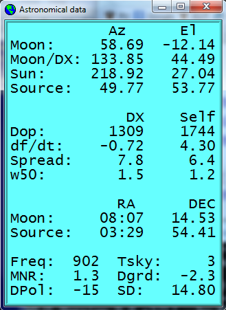

In JT65 and JT4 modes a small blue-background text box entitled *Moon*
presents data for tracking the moon, compensating for EME Doppler
shift, and estimating EME path degradation.  Select menu item *View |
Astronomical data* to see more such data in a separate window, as
shown below.

[[FigAstroData]]

Available information includes azimuth and elevation (*Az* and *El*)
for the Moon, Sun, and another astronomical source of your choice.
Right ascension (*RA*) and declination (*DEC*) for the additional
astronomical source should be entered on the *Setup | Options* window
in the decimal hours and degrees.  *Az* and *El* of the Moon are given
for the location of the DX station, as well as for the home station.
*Doppler* shift (in Hz) and rate of change of Doppler shift, *df/dt*,
in Hz/minute, are listed for two-way exchanges with the DX station,
and for self-echoes from the home station. *RA* and *DEC* are given
for the moon.  All on-screen coordinates are in degrees except for
*RA*, which is in hours and minutes.  *Tsky* gives the approximate
galactic background temperature in the direction of the moon, scaled
to the operating frequency *Freq*; *MNR* is the maximum
non-reciprocity of the EME path in dB, owing to spatial polarization;
*Dpol* is the spatial polarization offset, in degrees; *Dgrd* is an
estimate of the total signal degradation in dB, relative to the best
possible time when the moon is at perigee and in a cold part of the
sky; and *SD* is the moon's semi-diameter in arc minutes.

You may find it useful to know something about the nature and accuracy
of the astronomical calculations in _WSJT_.  The state of the art for
establishing three-dimensional locations of the sun, moon, and planets
at a specified time is embodied in a numerical model of the solar
system maintained at the Jet Propulsion Laboratory.  The model has
been numerically integrated to produce tabular data that can be
interpolated with very high accuracy.  For example, the celestial
coordinates of the moon or a planet can be determined at a specified
time to within about 0.0000003 degrees.  Although the ephemeris tables
and interpolation routines could easily be incorporated into _WSJT_,
the accuracy provided would be overkill for our desired purposes.
Instead, _WSJT_ uses closed-form calculations based on a limited
number of harmonic terms that have been fit to the high-accuracy data.

The precise algorithms used for solar and lunar positions were
developed by Van Flandern and Pulkkinen (Astrophysical Journal
Supplement Series, 44, 391-411, 1979).  Series expansions from this
paper yield accuracies of about 0.02 and 0.04 deg for the sun and moon
positions, respectively, and they will remain almost this good for
nearly a thousand years.  At this level of accuracy the effects of
nutation and aberration can be ignored, as can most of the smaller
planetary perturbations. (Perturbations involving the Moon, Jupiter,
Saturn, and Uranus are included, however.)  Ephemeris Time and
Universal Time are taken as equivalent, and the time steps associated
with leap seconds are ignored.  These and all other approximations
employed are consistent with the specified accuracy level.

Coordinates displayed for the sun are geocentric.  Since the moon
is much closer its diurnal parallax is significant, and therefore
topocentric coordinates are given for your specified location.  For
both sun and moon, the listed elevation is the apparent position of
the center of the disk.  To improve the accuracy of predicted Doppler
shifts of EME signals, a larger number of terms was used in the series
expansion for lunar distance.  _WSJT_ properly accounts for the
oblateness of the Earth when establishing locations relative to the
Earth's center.  Final accuracy of the Doppler shifts computed by _WSJT_
is better than 1 Hz at 144 MHz, and this has been confirmed by direct
comparison with a calculation based on the JPL ephemeris.

The sky background temperatures reported by _WSJT_ are derived from the
all-sky 408 MHz map of Haslam et al. (Astronomy and Astrophysics
Supplement Series, 47, 1, 1982), scaled by frequency to the (-2.6)
power.  This map has angular resolution of about 1 degree, and of
course most amateur EME antennas have much broader beamwidths than
this.  Your antenna will therefore smooth out the hot spots
considerably, and the observed extremes of sky temperature will be
less.  Unless you understand your sidelobes and ground reflections
extremely well, it is unlikely that more accurate sky temperatures
would be of much practical use.

