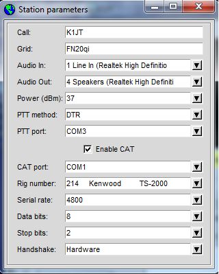

=== Station Parameters

- Connect appropriate interface cables between radio and computer.
Details will depend on your interface hardware; in general you will
need to connect the radio's audio output to the computer's soundcard
input, and for receive-only systems that's all you need! If you will
also be transmitting you must patch soundcard output to the radio's
microphone or data input. For T/R switching and CAT control you may
need a serial data cable or cables.

- Start _{prog}_ and select *Station parameters* from the *Setup*
menu.  Enter your callsign and 6-digit grid locator, select audio
input and output devices, and select your transmitter power in
dBm. (See Appendix A for a Watts-to-dBm conversion table.)  Compound
callsigns such as PJ4/K1ABC, W7/VE3DEF, and WA2XYZ/37 are permitted
but should be used only when necessary.  Double-compound callsigns
such as PJ4/K1ABC/P are not supported. SWLs should provide a unique
identifier (up to 8 characters) in place of a callsign.

[[FigOptions]]
 

- If you choose to transmit as well as receive, _{prog}_ will control
the T/R sequencing. Select the desired PTT method (DTR, RTS, CAT, or
VOX). For DTR- or RTS-controlled switching, select a PTT port. For
receive-only or VOX-controlled systems, set PTT port to None.

- _{prog}_ offers limited CAT control of your transceiver, usable for
T/R switching and frequency setting. To use this feature check *Enable
CAT* and fill in the remaining parameters. Consult the manual for your
radio to determine necessary parameter values for the serial
connection.

[[FONTS]]
=== Fonts

You can control the fonts and colors used in _WSJT_.  A text file
named +wsprrc.win+ (on Windows) or +wsprrc+ (on Linux and OS X) is
supplied with the following contents:

 *font:                  Arial 8
 *Label*font:            Arial 8
 *Text*font:             "Courier New" 10
 *Canvas*font:           "Lucida Console" 16
 *background:            gray85
 *Text*background:       white
 *Entry*background:      white
 *foreground:            black
 *Listbox*foreground:    RoyalBlue

You can edit this file with a text editor (such as Windows Notepad).
For example, to make the on-screen fonts slightly larger you can
increase the numbers on the first three lines to 9, 9, and 11.  It
might be wise to save a backup of the original file under a different
name, in case you need to restore the original contents.

