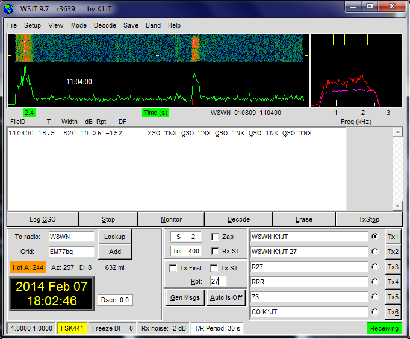
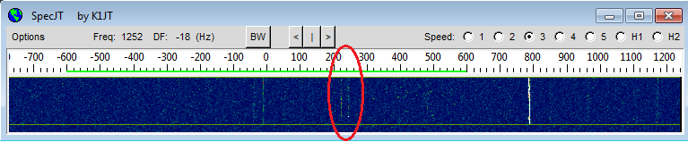
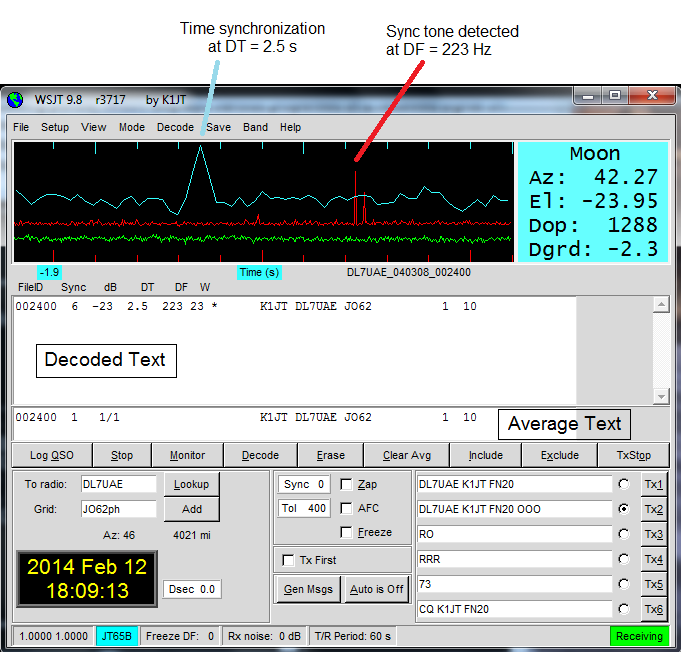
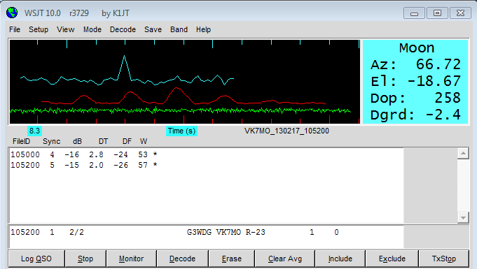
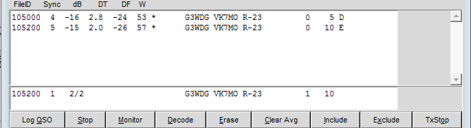

=== Basics

Decoding and operating procedures are different for the various _WSJT_
modes, so it helps to practice with each mode before using it on the
air.  As a useful starting point, take at least the following steps:

- Select *FSK441* from the *Mode* menu on the main window.

- Select *File | Open*,navigate to the +RxWav\Samples+ folder in your
_WSJT_ home directory, and open the sample file
+W8WN_010809_110400.wav+.  Your main screen should look something like
the image below.  The larger graphical area displays a spectrogram in
which time increases from left to right and frequency from bottom to
top.  The green curve below the spectrogram shows total power over the
full received bandwidth.  In FSK441 mode, the smaller graphical area
at right displays average spectra of the full record (magenta) and of
the strongest detected ``ping'' (red).

[[FigMainWindow]]

- Click with the right mouse button around the location of the ping at
time t = 19 s on the graphical display, and observe the decoded text
that appears.  The time corresponding to the location of the mouse
pointer is displayed in the green label at lower left of the main-window
plot area.

- Click on the static crashes around t = 1 s or elsewhere on the green
line.  You will probably see garbage text, or nothing.

- Use _Windows Media Player_ (or the equivalent program for your
operating system) to play this audio file and listen to the signal.
The file starts with a burst of summertime QRN and then has nothing
but background noise until a moderately strong FSK441 ping appears
about 18 seconds later.

To follow the full tutorial -- and it's strongly recommended that you
should do this -- download the collection of sample wave files
available in {samples_zip} (Windows) or {samples_tar} (Linux) format.
These files contain recordings of real signals in typical on-the-air
situations, for each of the _WSJT_ modes.

- Extract the files to a suitable location such as +..\RxWav\Samples+
under your _WSJT_ installation directory.

- Exit _WSJT_ and delete your +WSJT.INI+ file (or temporarily rename
it to something else).  This will ensure that you start the tutorial
with everything in the default configuration.

- Restart _WSJT_ and position the main window conveniently on your
screen.

=== Fast Modes

It's convenient to think of the WSJT protocols in two groups -- fast
and slow.  The fast modes (JTMS, FSK441, ISCAT, and JT6M) send text
messages character-by-character, without forward error correction, at
rates ranging from nearly 200 characters per second (JTMS) down to
about 14 cps (JT6M).  JTMS and FSK441 attempt to make the best
possible use of the common, very short pings of meteor scatter, with
durations around 0.1 s and even less.  ISCAT and JT6M perform well
with somewhat longer signal enhancements, including those
characteristic of meteor/ionospheric scatter at 50 and 70 MHz, and
also aircraft scatter at 10 GHz.  The fast modes generally use T/R
sequences of length 30 s, with 15 s as an option.

.JTMS

- Select *JTMS* from the *Mode* menu.

- Set ping threshold *S* = 1 dB and frequency tolerance *Tol* = 25 Hz.
These controls can be adjusted upward or downward by left- or
right-clicking with the mouse.

- Select menu item *File | Open*, navigate to subdirectory
+...\RxWav\Samples\JTMS+ under your installation directory, and open
one of the files there.  JTMS generally does a good job of finding and
decoding pings by itself, and the transmitted message is correctly
decoded for three different pings in each of these two files, for
example:

------------
    111730  7.7  140  3 26  15   K1JT N5SIX          *
------------

- Each line of decoded text contains the starting time of the
transmission; the time *T* of each detected ping, relative to the
start of the file; the ping *Width* in ms; signal strength (S+N)/N in
*dB*; signal report *Rpt*; and measured frequency offset *DF* in Hz.

TIP: If the ping duration is sufficient for message repetitions to be
recognizable, the JTMS decoder attempts to average over them.  If it
considers the attempt successful, the average message is displayed
with an asterisk +*+ appended at the end of line.

- Note that the average *DF* for these signals is about +22 Hz.
Checking *Freeze* will force the decoder to cover only a specified
range, *Freeze DF* ± *Tol*.  The value of *Freeze DF* is displayed in
the *Status Bar*; it can be changed in ±5 Hz increments with function
keys *F11* and *F12*.  Once you have identified the signal of a QSO
partner, it is usually best to set *Freeze DF* close to the signal's
measured *DF* and to check the *Freeze* box.

- Experiment with different settings of *Freeze*, *Freeze DF*, and
*Tol*.  Click *Decode* after each change to observe the results.
The *Tol* setting is sometimes interpreted generously.

- Try clicking on the main-window spectrogram to decode signal
present at a particular time.  Such action will sometimes decode a
signal that failed to decode automatically.

.FSK441

- Switch to FSK441 mode and open the file +K5CZD_050723_134100.wav+ in
the +...\Samples\FSK441+ subdirectory.  The decoder produces the
following text in the main text box:

----
    O1JT 26 K5CZD 2626 K1JT 27 K5CZ #6
----

- K5CZD is sending K1JT the signal report 26.  In FSK441 mode it
is not uncommon to see some incorrect characters, especially near the
ends of decoded sequences where the signal is weak.

- Hit the *F6* key (or select *File | Open next in directory*) to open
and decode successive files in the FSK441 directory.  These recordings 
contain the following easily decoded messages:

---------
    B KI4BWW K8EB KI4BWW K8EB KI4BWW K8
    32 CQ KC0HLN EN32 CQ KC0HLN E
    LN K1JT KC0HLN K1JT KC0HLN K1JT K
    6 JT R26 JT R26 JT R25 JT R
    K1JT KM5ES K1JT KM5ES K1JT KM5ES K1JT
    26 K1JT 26 KM5ES 
    M5PO K1JT KM5PO K1JT KM5PO K1JT KM5PO
    EGT CQ DE N9EGT CQ DE N9EGT CQ DE N9E
---------

- Try left- and right-clicking on pings in any of these files to
invoke the decoder at a particular location in the file.

- Click *Erase* at any time to clear the display areas.

- Click *Decode* for repeat analysis of a whole file.

- Open the first KC0HLN file again.  Double-click on the decoded
callsign and observe what happens in the Tx message boxes.  The
program is now ready for K1JT to answer the CQ from KC0HLN.

.ISCAT

- Switch to mode *ISCAT-B* and open any file in the
+...\Samples\ISCAT-B+ subdirectory.  These files contain recordings of
ionospheric scatter signals on 6 meters.  The signals are inaudible
most of the time, but they decode readily nevertheless.

- You can instruct the ISCAT decoder to concentrate on a particular
portion of a received sequence.  *Left-click* to decode in a 4-second
region centered on the mouse pointer.  *Right-click* to decode from
the beginning to the pointer.  *Swipe* with the left mouse button
depressed to decode over any desired range.

- *Open* the file +K0AWU_100714_120200.wav+.  The spectrogram shows
little sign of any signal except for barely visible enhancements
around t = 2.1 and t = 5.5 s.  Nothing is visible (or audible) after
about t = 8 s.  Nevertheless, try a *Swipe* to decode between about 9
and 25 s.  The message +THUNDER+ should be decoded.

- Switch now to mode *ISCAT-A* and examine files in the
+...\Samples\ISCAT-A+ subdirectory.  VK7MO and VK3HZ are completing a
10 GHz QSO over a 600 km path, using low power, small dishes, and
airplane-scatter propagation.  The signals are barely audible, if at
all -- but ISCAT decodes them flawlessly.

TIP: Usable ISCAT signals are often well below the noise, so signal
strengths are quoted as S/N rather than (S+N)/N. 

///////////
The four numbers following each decoded message give the detected
message length in characters (including the invisible
beginning-of-message character); the worst-case confidence level for
any character in the decoded message, on a 0-10 scale; the average
confidence level for all characters in the message, on the same 0-10
scale; and the length in seconds of a selected data segment yielding
highest confidence levels.  These numbers have been useful in
optimizing the ISCAT decoder; they may be removed in future.
////////////

.JT6M

- Switch to mode JT6M and open file +AA9MY_030323_142300.wav+ in the
JT6M subdirectory.  You should see decoded text 

----
    9MY 73 DE AA9MF2
----

- Try left-clicking near t = 15.0 s.  You should be able to obtain the
average message shown below.  (Averaged messages are indicated by an
asterisk +*+ near the end of line, followed by the message length.)

----
    73 DE AA9MY         *
----

- Hit *F6* to read and decode subsequent files in the JT6M directory.
You will see AC5TM working K1SIX, AF4O working K1JT, and WA5UFH
working K0AWU.  In several files the signals are inaudible or barely
audible, yet still decodable.  The second AF4O file produces no
decoded text by default, but try right-clicking at t = 16.8 s.  

- Find several other examples of decodable text in flat regions on the
green curve.  For example, try left-clicking at t = 7.4 s or t = 9.8 s
in the first AF4O file, or at t = 11.6 s in the second AF4O file.

=== Slow Modes

The slow modes in _WSJT_ are designed for signals that are very weak
-- perhaps averaging 10 dB or more below the audible threshold -- but
more or less steady.  These modes use strong error-control coding, so
the software generally decodes a transmission exactly as it was sent,
or not at all.  T/R sequence lengths are usually one minute.

.JT65A

- Switch to mode JT65A.  

- Select *View | SpecJT* if you have previously deleted this window.
If the SpecJT and _WSJT_ windows overlap on your screen, reduce the
vertical size of the SpecJT window so that only its top half shows.

- Select *Speed 3* on the SpecJT window.

- Check the following items on the SpecJT *Options* menu:

* *Mark T/R boundaries*
* *Flatten spectra*
* *Mark JT65 tones only if Freeze is checked*
* *JT65 DF axis*.

- Select *File | Open* on the main window, navigate to the
+...\Samples\JT65A+ directory, and open the file
+F9HS_031120_074800.wav+.  The SpecJT screen will show a messy
spectrum cluttered with birdies at 100 Hz intervals and other
interfering signals.  However, the red curve in the main-screen
graphical area shows a strong JT65 sync tone amongst the clutter, and
the decoder produces

----
  074800 2 -20 2.6 361  3 *   K1JT F9HS JN23      1  0
----

- Double-click on +F9HS+ in the text window.  This callsign will be
copied into the *To Radio* box; the database will be searched and the
grid locator retrieved, if available. Tx messages will be generated
for a QSO with F9HS, and the Tx message pointer will be set to message
#2 so that the signal report OOO will be sent.  During actual
operation, all of this can take place in the few seconds near the end
of a reception interval, before your next transmission starts.

- Hit *F6* to open the next file.  A smaller red spike appears,
indicating successful synchronization, and you will see that G3FPQ is
calling W7GJ:

 131900 1 -25 1.5 43 3 *    W7GJ G3FPQ IO91     1  0

TIP: Signals become visible on the waterfall around S/N = -26 dB, and
audible to someone with good hearing around -15 dB. 

.JT65B

- Select JT65B from the *Mode* menu and click *Clr Avg*.

- Go to *File | Open*, navigate to inside the JT65B directory, and
open the DL7UAE file.  The waterfall shows a strong birdie at DF = 783
Hz and several weaker signals.  The ones at DF = 223 and DF = 244 Hz
look most interesting because they seem to show the speckled pattern
typical of a JT65 signal.

- _WSJT_ chooses the signal at DF = 223 Hz as the most
promising, and decodes it to reveal DL7UAE answering a CQ from K1JT.

- The red curve shows a second spike that looks almost as good as the
DL7UAE signal. Experiment to see if you can determine who else might
be calling.  (The answer and how to find it are given below, at the
end of this section.)

- When you are ready to continue, clear *Freeze* and *AFC*, click
*Erase* and *Clr Avg*) and hit *F6* to open the next file.  The green
curve shows some nasty SSB QRM starting at t = 5.3 s into the file.
(Again, you might want to listen to this file.)  Some rhythmic
broadband noise is also present, showing clearly on the green line.
Fortunately, the waterfall looks nearly clean in the important JT65
spectral region, and _WSJT_ has no problem decoding the signal at DF =
-46 Hz.  EA5SE is sending K1JT the default OOO signal report.

  000400 2 -25 2.9 -46 3 # K1JT EA5SE IM98 OOO    1  0 

- Try double-clicking on the sync tone in the waterfall, or on the red
spike in the main-screen graphics area.  Either action will
automatically check *Freeze*, set *Freeze DF* to the selected
frequency and *Tol* to 50 Hz, and click *Decode*.  The red curve
will show that the sync-tone search range has been reduced to ±50 Hz
around the selected frequency.

- Take note of the colored tick marks on the frequency scale at the
top of the *SpecJT* window.  The leftmost vertical green mark shows
the selected *Freeze DF*, and the horizontal band below it shows the
range that will be searched for a sync tone.  The other green tick
marks the upper limit of the JT65 data tones, and red ticks mark the
frequencies used for JT65 shorthand messages.

- Hit *F6* to open the next file.  You will see EA5SE sending K1JT the
shorthand message RRR.  Magenta and orange curves in the main-screen
graphics area show the measured average spectra for two distinct
phases of the shorthand message cycle.  In the waterfall display you
should see the alternating tones for RRR accurately aligned with the
sync-tone marker and the second red marker.  Hit the *F6* key once
more to decode the final transmission of this QSO, with ES5SE sending
a shorthand 73 to K1JT.

- Uncheck *Freeze* and hit *F6* again.  The waterfall shows a likely
sync tone with deep libration fading at DF = -22 Hz, and the decoder
shows EI4DQ sending K1JT the OOO signal report.  Double-click on the
sync tone in either window to lock him in, and hit *F6* to open the
next file.  EI4DQ has received the OOO report from K1JT and
is now sending RO.

- Clear the *Freeze* box, check *JT4 and JT65 | Normal Deep Search* on
the *Decode* menu, and hit *F6* to open the next file.  Two birdies
are in the passband, but _WSJT_ ignores them and finds a valid sync
tone at DF = 221 Hz, decoding IK1UWL sending the OOO report to K1JT.
Check *AFC* and hit the *Decode* button; you will notice that the
first number near the end of the decoded line changes from 0 to 1,
indicating that with *AFC* invoked, the Reed-Solomon decoder succeeds.
(Otherwise, the Deep Search decoder is required to decode this file.)

- Double-click on the sync tone (spike on the red curve) to lock in
IK1UWL, and wait for the next transmission (i.e., hit *F6* to read the
next file).  IK1UWL has copied the report RO from K1JT, so he is
sending RRR.  Note that this shorthand message is barely visible on
the waterfall, but it is still decoded correctly.  K1JT would now send
73 to signify that the QSO is complete.

- Clear the *Freeze* and *AFC* boxes and hit *F6* to find RU1AA
calling CQ.  RU1AA has a big EME signal; his tones in this file are
easily audible.  In the next several files K1JT works him quickly,
despite two birdies that are drifting down through the JT65 signal
passband.  Notice that as a reminder, decoded shorthand messages are
always flagged with a ``?'' mark unless you have turned *Freeze* on
and set *Tol* to 100 Hz or less -- things that you should always do,
for best decoding results.  RU1AA ends the QSO by sending the message
``TNX JOE -14 73'' to tell K1JT that his signal peaked at -14 dB.
Since this message does not start with two callsigns (or CQ or QRZ
plus one callsign) it is treated as a plain text message.  Such
messages can convey no more than 13 characters, so in this case the
final ``73'' was truncated.

- Clear the *Freeze* box and hit *F6* to show another big Russian
signal: RW1AY/1 is answering a CQ from K1JT.  Double-click on the sync
tone (on either window) to lock it in, and then hit *F6* to see the
messages RO, 73, and -19TNXQSO 73 in the next three transmissions.

- Were you able to decode the second signal in the DL7UAE file?  If
so, congratulations!  If not, clear *Freeze* and go back to *File |
Open* and select the first file again.  Left-click on the smaller red
spike, check *Freeze* on, and reduce *Tol* to 10 Hz.  Then hit
*Decode*, and you should see SP6GWB calling K1JT with an excellent
signal.  The DL7UAE and SP6GWB signals are separated by only 22 Hz, so
most of their tones overlap in the 355 Hz passband of JT65B.
Nevertheless, the decoder copies perfectly with the help of its robust
error-correcting code.

- While you have the DL7UAE file in memory, *Freeze* on, *Tol* = 10
Hz, and *Freeze DF* set on the smaller red spike, hit *F2* to open the *Setup |
Options* screen and enter your own call (or some other call) in place
of K1JT in the My Call box.  Then dismiss the *Options* screen and try
to decode the SP6GWB signal again.  You will surely fail, because for
this message successful copy was obtained as a result from the Deep
Search decoder.

.JT4

- Switch to mode JT4F, go to subdirectory +...Samples\JT4F+, and open
files +VK7MO_130217_105000.wav+ and +VK7MO_130217_105200.wav+
sequentially.  These are recordings of the 10 GHz EME signal of VK7MO
(77 cm dish, 40 W) made at G3WDG (3 m dish).  Nothing is visible on
the SpecJT waterfall, and neither recording decodes by itself.  But
_WSJT_ recognizes and saves the potentially usable symbol spectra from
each file, and produces a perfect decode from their average.

- Confirm for yourself that with *My Call* set to G3WDG and *Normal
Deep Search* selected on the *Decode | JT4 and JT65* menu, each of
these files can be decoded properly on its own.

